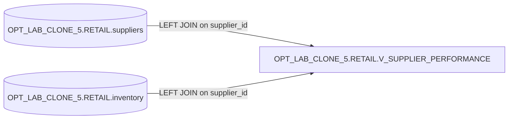

# Lineage — OPT_LAB_CLONE_5.RETAIL.V_SUPPLIER_PERFORMANCE

## Object-level lineage

- **Target**: `OPT_LAB_CLONE_5.RETAIL.V_SUPPLIER_PERFORMANCE` (VIEW)
- **Sources**:
  - `OPT_LAB_CLONE_5.RETAIL.suppliers` (table)
  - `OPT_LAB_CLONE_5.RETAIL.inventory` (table)

## Notes

- `LEFT JOIN` preserves all supplier rows.
- Metrics are produced via grouped aggregation (no window functions).

