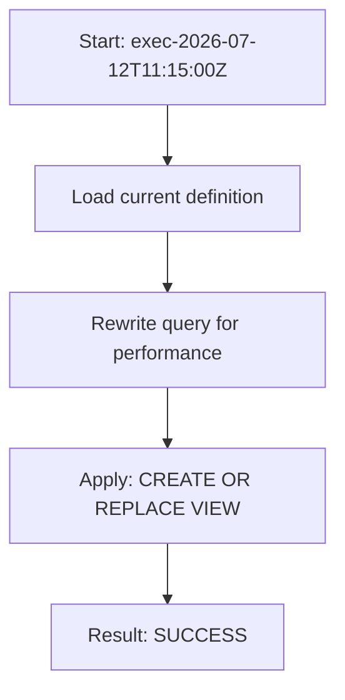

# Procedure flow — OPT_LAB_CLONE_5.RETAIL.V_SUPPLIER_PERFORMANCE

This optimization execution applied a new view definition.

## High-level flow



## Applied SQL

```sql
CREATE OR REPLACE VIEW OPT_LAB_CLONE_5.RETAIL.V_SUPPLIER_PERFORMANCE AS
/*
  Optimized supplier performance view

  Optimizations:
  1) Removed DISTINCT combined with window functions to avoid redundant sorting and de-duplication.
     - Replaced with an aggregated query grouped by supplier_id (and other projected supplier attrs).
  2) Aggregated metrics using standard GROUP BY instead of window functions, which is more efficient
     and semantically clearer for per-supplier metrics.
  3) Fully qualified table references with database and schema for stability.
  4) Preserved LEFT JOIN semantics so suppliers without inventory still appear with NULL metrics.
*/
SELECT
    s.supplier_id,
    s.supplier_name,
    s.country,
    COUNT(i.inventory_id) AS sku_count,
    AVG(i.qty_on_hand)   AS avg_stock
FROM OPT_LAB_CLONE_5.RETAIL.suppliers AS s
LEFT JOIN OPT_LAB_CLONE_5.RETAIL.inventory AS i
    ON i.supplier_id = s.supplier_id
GROUP BY
    s.supplier_id,
    s.supplier_name,
    s.country;
```
