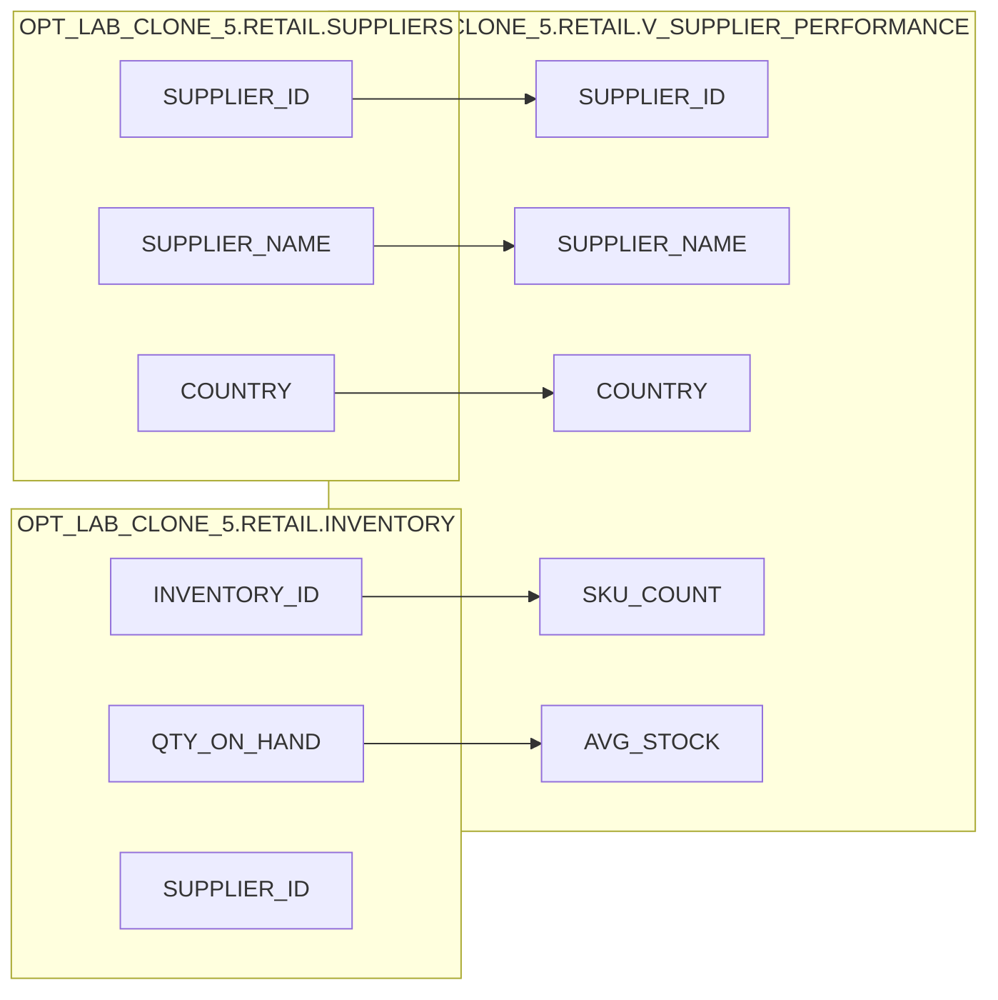

# Column Lineage — OPT_LAB_CLONE_5.RETAIL.V_SUPPLIER_PERFORMANCE

- **Database**: `OPT_LAB_CLONE_5`
- **Schema**: `RETAIL`
- **View**: `V_SUPPLIER_PERFORMANCE`
- **Execution**: `exec-2026-07-12T14:30:00Z`

## Column-level mapping

| Output column | Source columns | Transformation |
|---|---|---|
| `SUPPLIER_ID` | `OPT_LAB_CLONE_5.RETAIL.SUPPLIERS.SUPPLIER_ID` | Direct projection |
| `SUPPLIER_NAME` | `OPT_LAB_CLONE_5.RETAIL.SUPPLIERS.SUPPLIER_NAME` | Direct projection |
| `COUNTRY` | `OPT_LAB_CLONE_5.RETAIL.SUPPLIERS.COUNTRY` | Direct projection |
| `SKU_COUNT` | `OPT_LAB_CLONE_5.RETAIL.INVENTORY.INVENTORY_ID` | `COUNT(INVENTORY_ID)` after LEFT JOIN, grouped by supplier attributes |
| `AVG_STOCK` | `OPT_LAB_CLONE_5.RETAIL.INVENTORY.QTY_ON_HAND` | `AVG(QTY_ON_HAND)` after LEFT JOIN, grouped by supplier attributes |

## Column lineage diagram

