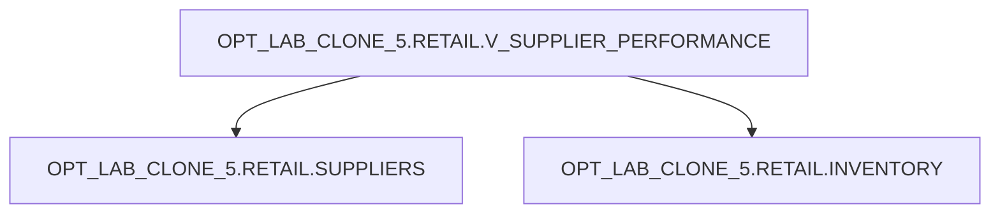

# Lineage — OPT_LAB_CLONE_5.RETAIL.V_SUPPLIER_PERFORMANCE

- **Database**: `OPT_LAB_CLONE_5`
- **Schema**: `RETAIL`
- **View**: `V_SUPPLIER_PERFORMANCE`
- **Execution**: `exec-2026-07-12T14:30:00Z`

## Object-level lineage

## Join + aggregation

- **Join**: `SUPPLIERS s` LEFT JOIN `INVENTORY i` ON `i.supplier_id = s.supplier_id`
- **Aggregation**: `GROUP BY s.supplier_id, s.supplier_name, s.country`
- **Measures**:
  - `sku_count = COUNT(i.inventory_id)`
  - `avg_stock = AVG(i.qty_on_hand)`
