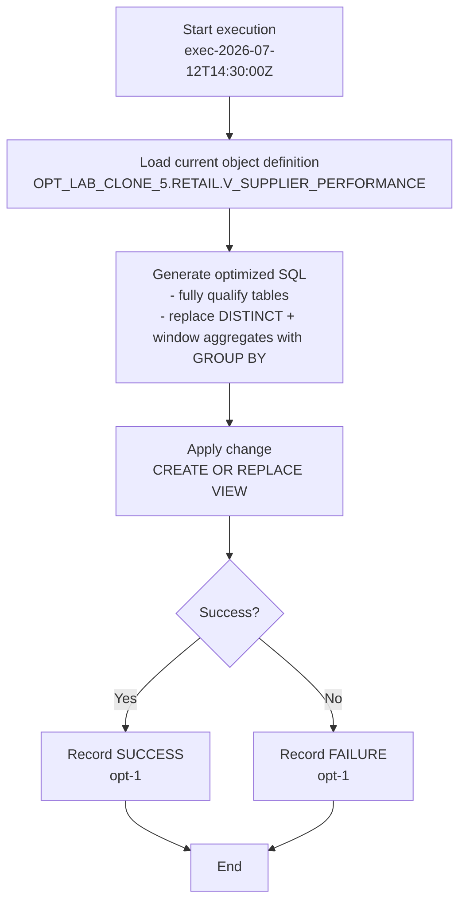

# Procedure Flow — exec-2026-07-12T14:30:00Z

- **Warehouse**: `ADF_WH`
- **Database**: `OPT_LAB_CLONE_5`
- **Mode**: `APPLY`
- **Objects attempted**: 1
- **Succeeded**: 1
- **Failed**: 0

## Flow



## Task: opt-1

- **Object**: `OPT_LAB_CLONE_5.RETAIL.V_SUPPLIER_PERFORMANCE`
- **Type**: `VIEW`
- **Status**: `SUCCESS`

### Applied SQL

```sql
CREATE OR REPLACE VIEW OPT_LAB_CLONE_5.RETAIL.V_SUPPLIER_PERFORMANCE AS
/*
  Optimized view: supplier performance

  Optimizations:
  1) Fully qualify SUPPLIERS and INVENTORY tables to avoid search-path dependence.
  2) Replace DISTINCT + window aggregates with grouped aggregates to remove
     redundant row processing while preserving the output schema and semantics.
*/
SELECT
    s.supplier_id,
    s.supplier_name,
    s.country,
    COUNT(i.inventory_id) AS sku_count,
    AVG(i.qty_on_hand) AS avg_stock
FROM OPT_LAB_CLONE_5.RETAIL.SUPPLIERS AS s
LEFT JOIN OPT_LAB_CLONE_5.RETAIL.INVENTORY AS i
    ON i.supplier_id = s.supplier_id
GROUP BY
    s.supplier_id,
    s.supplier_name,
    s.country
```
