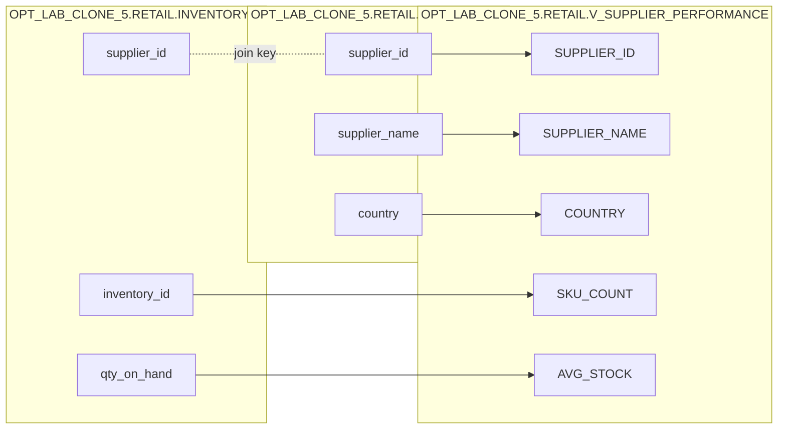

# Column Lineage

**Target:** `OPT_LAB_CLONE_5.RETAIL.V_SUPPLIER_PERFORMANCE` (VIEW)  
**Execution ID:** `exec-2026-07-12T12:45:00Z`

## Mapping Table

| Target column | Source expression |
|---|---|
| `SUPPLIER_ID` | `s.supplier_id` |
| `SUPPLIER_NAME` | `s.supplier_name` |
| `COUNTRY` | `s.country` |
| `SKU_COUNT` | `COUNT(i.inventory_id)` |
| `AVG_STOCK` | `AVG(i.qty_on_hand)` |
