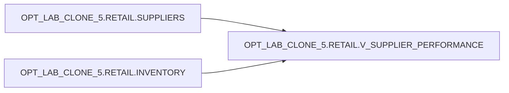

# Lineage

**Object:** `OPT_LAB_CLONE_5.RETAIL.V_SUPPLIER_PERFORMANCE` (VIEW)  
**Execution ID:** `exec-2026-07-12T12:45:00Z`

## Object-Level Lineage

## Notes

- `LEFT JOIN` ensures every supplier remains in the output even when no matching inventory rows exist.
- Aggregations are performed via `GROUP BY (supplier_id, supplier_name, country)`.
