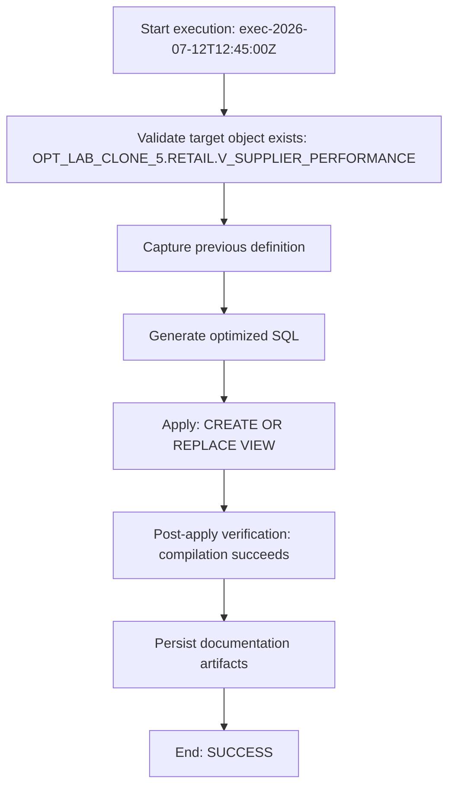

# Procedure / Execution Flow

**Execution ID:** `exec-2026-07-12T12:45:00Z`  
**Warehouse:** `ADF_WH`  
**Mode:** APPLY



## Applied SQL

```sql
CREATE OR REPLACE VIEW OPT_LAB_CLONE_5.RETAIL.V_SUPPLIER_PERFORMANCE AS
/*
  Optimized "supplier performance" view

  Optimizations:
  1) Fully qualified base tables (OPT_LAB_CLONE_5.RETAIL.SUPPLIERS and
     OPT_LAB_CLONE_5.RETAIL.INVENTORY) to avoid search-path ambiguity.
  2) Replaced DISTINCT + window functions with grouped aggregates, which
     removes redundant deduplication while preserving the result set:
       - COUNT(i.inventory_id) OVER (PARTITION BY s.supplier_id)
         → COUNT(i.inventory_id)
       - AVG(i.qty_on_hand) OVER (PARTITION BY s.supplier_id)
         → AVG(i.qty_on_hand)
     grouped by supplier_id, supplier_name, country.
  3) Preserved LEFT JOIN semantics so suppliers without inventory still
     appear with sku_count = 0 and avg_stock = NULL.
*/
SELECT
    s.supplier_id,
    s.supplier_name,
    s.country,
    COUNT(i.inventory_id) AS sku_count,
    AVG(i.qty_on_hand)    AS avg_stock
FROM OPT_LAB_CLONE_5.RETAIL.SUPPLIERS AS s
LEFT JOIN OPT_LAB_CLONE_5.RETAIL.INVENTORY AS i
    ON i.supplier_id = s.supplier_id
GROUP BY
    s.supplier_id,
    s.supplier_name,
    s.country
```
