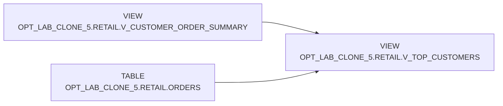

# Lineage — OPT_LAB_CLONE_5.RETAIL.V_TOP_CUSTOMERS

- **Execution:** exec-2026-07-12T16:30:00Z

## Object-level lineage

## Notes
- `V_TOP_CUSTOMERS` selects customer attributes and `total_spent` from `V_CUSTOMER_ORDER_SUMMARY`.
- Returned orders are computed from `ORDERS` with `status = 'RETURNED'`, aggregated by `customer_id`, and `LEFT JOIN`ed to the summary.
