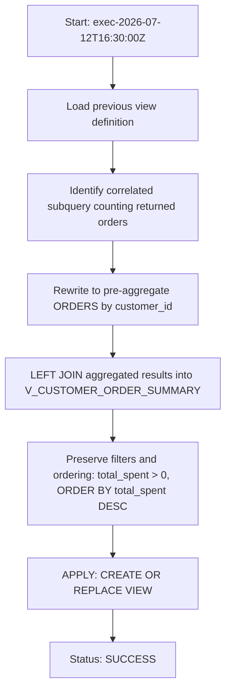

# Procedure Flow — Optimization APPLY

- **Execution:** exec-2026-07-12T16:30:00Z
- **Object:** OPT_LAB_CLONE_5.RETAIL.V_TOP_CUSTOMERS (VIEW)

## Change detail
- **Before:** per-row correlated subquery:
  - `SELECT COUNT(*) FROM orders o WHERE o.customer_id = s.customer_id AND o.status='RETURNED'`
- **After:** single aggregation + join:
  - Aggregate `ORDERS` once: `GROUP BY o.customer_id` with `WHERE o.status='RETURNED'`
  - Join on `customer_id`
